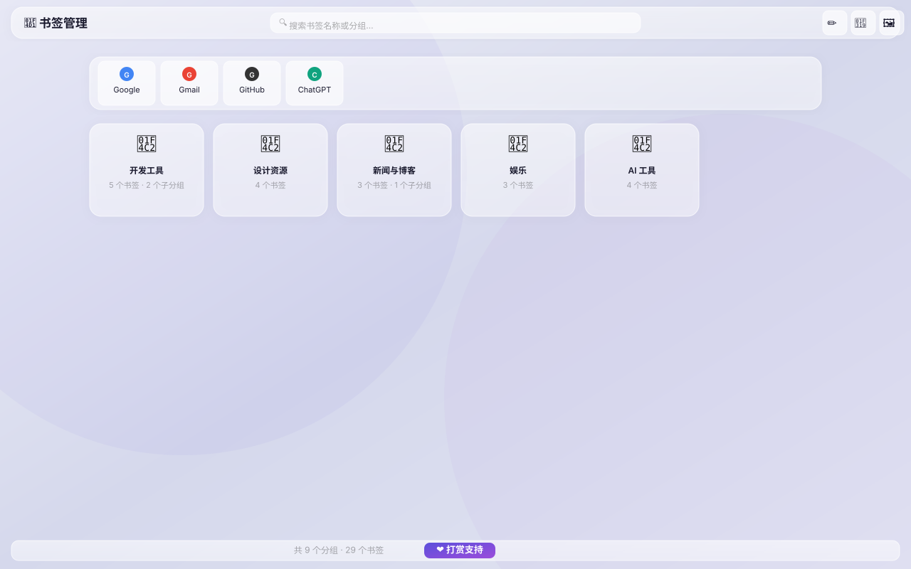
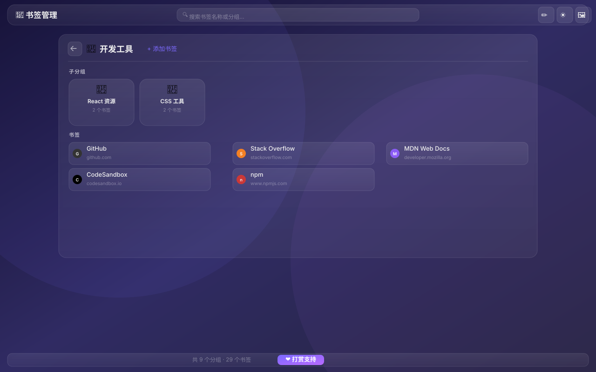
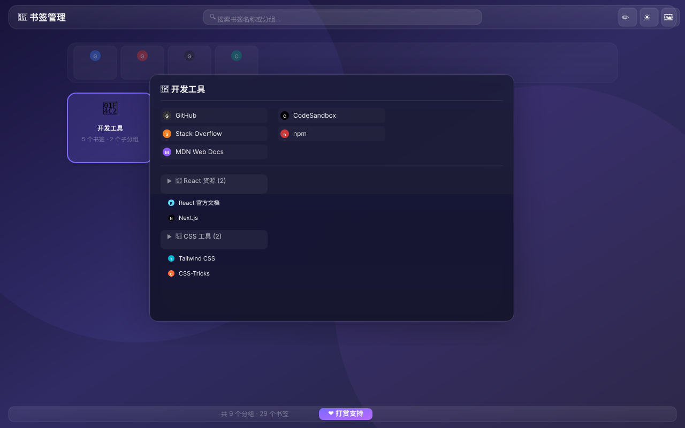

<p align="right">
  <a href="README.zh.md">🇨🇳 中文</a>
</p>

# 📑 Glass Bookmarks

> A gorgeous new-tab bookmark manager for Chrome, with glassmorphism design, folder grouping, and dark/light themes.  
> Turn your Chrome bookmarks into a beautiful new tab page. **Free to install** — no developer account required.

---

## ✨ Features

| Feature | Description |
|---------|-------------|
| 🪟 **Glassmorphism UI** | Elegant frosted-glass design with dark/light themes |
| 🏠 **New Tab Replacement** | Instantly replaces `chrome://newtab` with your bookmarks |
| 📂 **Grouped by Folder** | Automatically organized by your Chrome bookmark folders |
| 📌 **Pinned Bookmarks** | Top-level bookmarks pinned at top for one-click access |
| 🔍 **Instant Search** | Real-time filtering with highlighted matches |
| 🖼️ **Hover Preview** | Hover any folder card for a spacious multi-column preview |
| 🎨 **Custom Backgrounds** | 6 gradient presets + custom image support |
| 🌙 **Dark/Light Mode** | Follows system preference or toggle manually |
| ✏️ **Edit Mode** | Edit, delete, and drag-and-drop bookmarks and folders directly |

---

## 📸 Screenshots

<p align="center">
  
  <br><em>Home page — light theme</em>
</p>

<p align="center">
  
  <br><em>Folder detail — dark theme</em>
</p>

<p align="center">
  
  <br><em>Hover preview — floating multi-column popup with bookmarks and sub-folders</em>
</p>

---

## 🔧 Installation (Developer Mode)

> 💡 This method loads the extension directly from your computer — no publishing required.

### 📥 Step 1: Get the Source Code

<details>
<summary><b>Option A — Git (recommended for easy updates)</b></summary>

```bash
git clone https://github.com/ryanch741/chrome-bookmark-manager.git
```
To update later, just run `git pull` inside the directory.
</details>

<details>
<summary><b>Option B — Download ZIP</b></summary>

1. Go to https://github.com/ryanch741/chrome-bookmark-manager
2. Click the green **<> Code** button → **Download ZIP**
3. Extract it to a folder on your computer
</details>

---

### 🛠️ Step 2: Load the Extension

#### 1️⃣ Open the Extension Management Page

Type this into Chrome's address bar and press Enter:

```
chrome://extensions
```

#### 2️⃣ Enable Developer Mode

Toggle the **Developer mode** switch in the **top-right corner**.

```
┌─────────────────────────────────────────────────┐
│  ☑ Developer mode        ← Toggle this on         │
│                                                    │
│  Load unpacked  Pack extension  Update             │
└─────────────────────────────────────────────────┘
```

#### 3️⃣ Load the Extension

Click the **Load unpacked** button in the top-left corner.

In the file picker, **select the `src` folder** inside the project directory (not the project root):

```
chrome-bookmark-manager/
├── src/                     ← Select this folder!
│   ├── manifest.json
│   ├── background.js
│   ├── app/
│   └── icons/
├── README.md
└── ...
```

#### 4️⃣ Done! 🎉

- **Open a new tab** — your bookmarks will appear
- If you already had a new tab open, **close and reopen it**
- You'll see this card in the extensions page:

```
┌──────────────────────────────────────────┐
│  📑 书签管理                    Enabled   │
│  A beautiful bookmark manager             │
│  ID: xxx                                  │
│                                           │
│  [Details] [Remove] [Refresh] [Errors]    │
└──────────────────────────────────────────┘
```

---

### 🔄 How to Update?

```bash
git pull
```
Then go back to `chrome://extensions` and click the **Refresh 🔄** button on the extension card.

---

## ❓ FAQ

### The new tab page didn't change?

Make sure you don't have **other new tab extensions** installed (e.g. Infinity, Momentum, iTab):
1. Go to `chrome://extensions` and check for other new tab extensions
2. Disable or remove them if found
3. Refresh or restart Chrome

### I see a "Developer mode extensions" warning every time I start Chrome?

This is normal. Chrome shows this warning as a security measure for all developer-mode extensions:
- Click **Cancel** or **Manage extensions** → keep it enabled
- It only shows occasionally after browser restart, not during use

### I can't see my bookmarks?

This extension shows bookmarks from your **Bookmarks Bar**:
- Bookmarks in "Other Bookmarks" won't appear on the home page
- You can move them to the Bookmarks Bar in Chrome's bookmark manager
- Or click into a folder card to see all its contents

### Does this extension collect my data?

**No.** This extension runs entirely offline:
- All bookmark data is read directly from your local Chrome
- **No remote servers** involved
- Favicons are loaded from Chrome's local cache via its built-in API
- **No network permissions required**

### How do I uninstall?

Go to `chrome://extensions`, find this extension, and click **Remove**. Your new tab page will revert to Chrome's default.

---

## 🗂️ Project Structure

```
├── src/                     # Extension source code
│   ├── manifest.json        # Manifest V3
│   ├── background.js        # Service Worker
│   ├── app/
│   │   ├── index.html       # New tab page
│   │   └── app.js           # Core logic
│   ├── icons/               # Extension icons (16/48/128)
│   ├── pay/                 # Donation QR codes
│   └── fonts/               # Icon font
├── install_app.command      # macOS one-click install script
└── README.md
```

---

## ⚙️ Tech Stack

- **Manifest V3** — Latest Chrome Extension spec
- **Vanilla JS** — No framework, lightweight
- **CSS Glassmorphism** — Frosted glass effects with `backdrop-filter`
- **Chrome Bookmark API** — Reads bookmarks directly from your browser
- **Chrome Favicon API** — Loads website icons from local cache

---

> 💡 **Enjoying it? Give the project a ⭐ Star on GitHub!**
